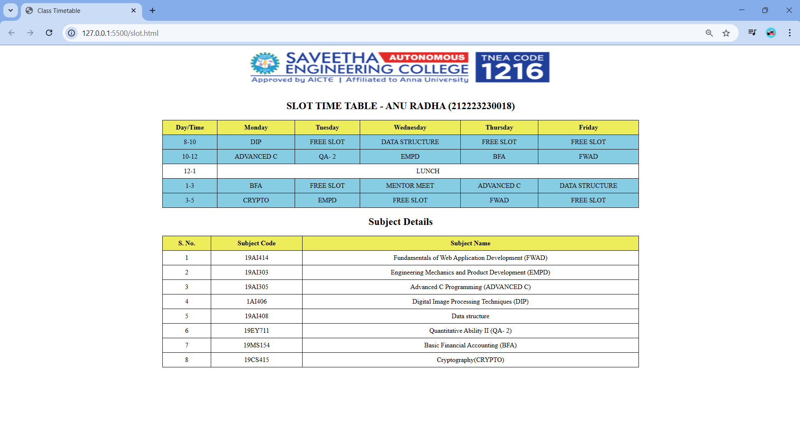

## Ex03: Slot Time Table

## Date: 17.04.2025

## AIM:

To write a html webpage page to display your slot timetable.

## ALGORITHM:

#### STEP 1:
Create a Django-admin Interface.

#### STEP 2:
Create a static folder and inert HTML code.

#### STEP 3:
Create a simple table using `<table>` tag in html.

#### STEP 4:
Add header row using `<th>` tag 


#### STEP 5:

Add your timetable using `<td>` tag.

#### STEP 6:
Execute the program using runserver command.

## PROGRAM :

```
<!DOCTYPE html><html>
<head>
    <title>Class Timetable</title>
    <style>
        table {
            width: 60%;
            border-collapse: collapse;
            margin-bottom: 20px;
        }
        th, td {
            border: 1px solid black;
            padding: 8px;
            text-align: center;
        }
        th {
            background-color: rgb(237, 237, 91);
        }
        .highlight {
            background-color: rgb(134, 204, 227);
        }
    </style>
</head>
<body>
<center>
    

    
<h2>SLOT TIME TABLE - ANU RADHA (212223230018) </h2>
<table>
    <tr>
        <th>Day/Time</th>
        <th>Monday</th>
        <th>Tuesday</th>
        <th>Wednesday</th>
        <th>Thursday</th>
        <th>Friday</th>
    </tr>
    <tr class="highlight">
        <td>8-10</td>
        <td>DIP</td>
        <td>FREE SLOT</td>
        <td>DATA STRUCTURE</td>
        <td>FREE SLOT</td>
        <td>FREE SLOT</td>
    </tr>
    <tr class="highlight">
        <td>10-12</td>
        <td>ADVANCED C</td>
        <td> QA- 2 </td>
        <td>EMPD</td>
        <td>BFA</td>
        <td>FWAD</td>
    </tr>
    <tr>
        <td>12-1</td>
        <td colspan="5">LUNCH</td>
    </tr>
    <tr class="highlight">
        <td>1-3</td>
        <td>BFA</td>
        <td>FREE SLOT</td>
        <td>MENTOR MEET</td>
        <td>ADVANCED C</td>
        <td>DATA STRUCTURE</td>
    </tr>
    <tr class="highlight">
        <td>3-5</td>
        <td>CRYPTO</td>
        <td>EMPD</td>
        <td>FREE SLOT</td>
        <td>FWAD</td>
        <td>FREE SLOT</td>
    </tr>
</table>

<h2>Subject Details</h2>
<table>
    <tr>
        <th>S. No.</th>
        <th>Subject Code</th>
        <th>Subject Name</th>
    </tr>
    <tr>
        <td>1</td>
        <td>19AI414</td>
        <td>Fundamentals of Web Application Development (FWAD)</td>
    </tr>
    <tr>
        <td>2</td>
        <td>19AI303</td>
        <td>Engineering Mechanics and Product Development (EMPD)</td>
    </tr>
    <tr>
        <td>3</td>
        <td>19AI305</td>
        <td>Advanced C Programming (ADVANCED C) </td>
    </tr>
    <tr>
        <td>4</td>
        <td>1AI406</td>
        <td>Digital Image Processing Techniques (DIP) </td>
    </tr>
    <tr>
        <td>5</td>
        <td>19AI408</td>
        <td>Data structure</td>
    </tr>
    <tr>
        <td>6</td>
        <td>19EY711</td>
        <td>Quantitative Ability II (QA- 2) </td>
    </tr>
    <tr>
        <td>7</td>
        <td>19MS154</td>
        <td>Basic Financial Accounting (BFA)</td>
    </tr>
    <tr>
        <td>8</td>
        <td>19CS415</td>
        <td>Cryptography(CRYPTO)</td>
    </tr>
</table>
</center>

</body>
</html>

```

## OUTPUT:


## RESULT:

The program for creating slot timetable using basic HTML tags is executed successfully.
